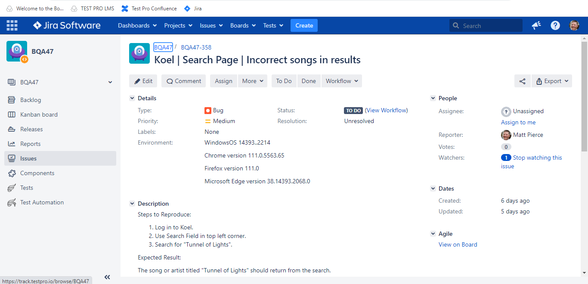
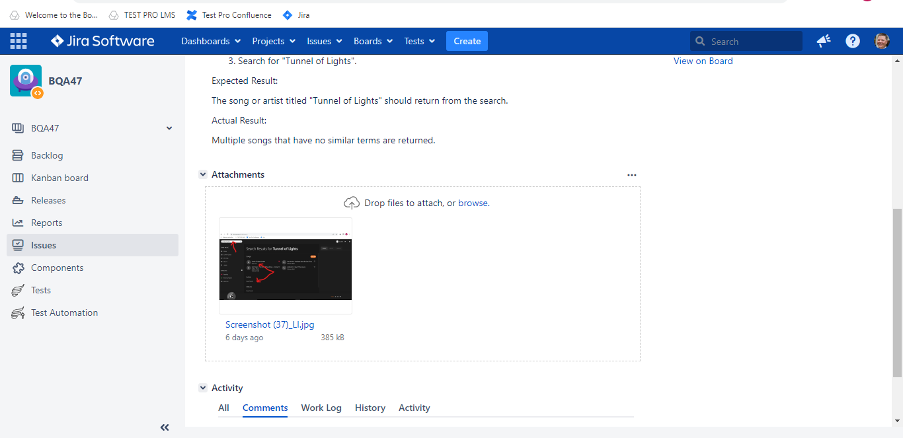

<h1>Bug Report Example</h1>

<h2>Description</h2>
Project consists of an example of writing a Bug Report using the critical elements such as:
Effective Title, Environment, Steps to Reproduce, Expected Result, Actual Result, and Annotated Image that explains where the bug is.
 

<h2>Utilities Used</h2>

- <b>GitHub, Koel Music App, Jira, TestPro, Images</b>

<h2>Environments Used </h2>

- <b>Windows 10</b> (21H2)

<h2>Project walk-through:</h2>

Bug Report Title, Enviroment, Steps to Recreate:  
   

 
 
Bug Report Expected Result, Actual Result, and Annotated Image  
   

 
 
